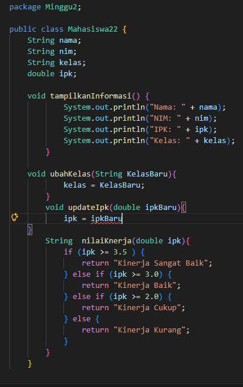
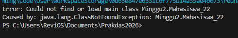
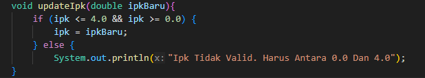
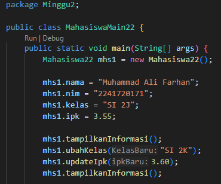
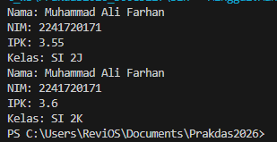
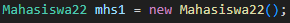
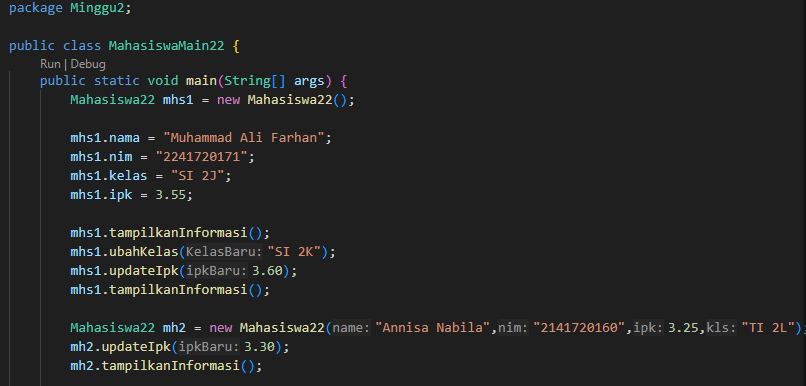
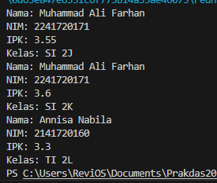
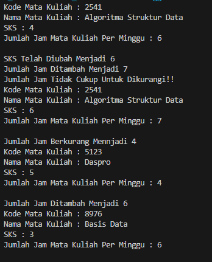
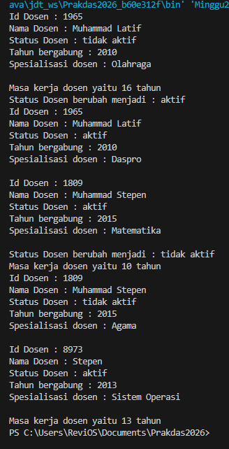

|  | Algoritma dan Struktur Data |
|--|--|
| NIM |  254107020235|
| Nama |  Muhammad Latif Sabilis Sudur |
| Kelas | TI - 1F |
| Repository | [link] https://github.com/muhlatif1809-ui/Praktikum-ASD.git

# Jobsheet 2 Object

## 2.1 Percobaan 1: Deklarasi Class, Atribut dan Method

## 2.1.2 Verifikasi Hasil Percobaan

## 2.1.3 Pertanyaan
    1. Dua karakteristik class/object:
        Memiliki atribut (data)
        Memiliki method (perilaku)
    2. Jumlah atribut class Mahasiswa:
        4 atribut, yaitu:
        nim
        nama
        kelas   
        ipk
    3. Jumlah method class Mahasiswa:
        4 method, yaitu:
        tampilkanInformasi()
        ubahKelas()
        updateIpk()
        nilaiKinerja()
    4. Modifikasi kode Program:

    5. Cara kerja method nilaiKinerja():
        Mengevaluasi kinerja mahasiswa berdasarkan nilai IPK
        Menggunakan rentang IPK sebagai kriteria
        Mengembalikan String berupa nilai kinerja (misalnya: “Sangat Baik”, “Baik”, dll)

## 2.2 Percobaan 2: Instansiasi Object, serta Mengakses Atribut dan Method

## 2.2.2 Verifikasi Hasil Percobaan

## 2.2.3 Pertanyaan
    1. Baris instansiasi object & nama object:

    2. Cara mengakses atribut & method objek:
        Menggunakan namaObjek.atribut
        Menggunakan namaObjek.method()
    3. Alasan output tampilkanInformasi() berbeda:
        Karena nilai atribut objek sudah berubah sebelum pemanggilan kedua

## 2.3 Percobaan 3: Membuat Konstrukto

## 2.3.2 Verifikasi Hasil Percobaan

## 2.3.3 Pertanyaan
    1. Baris konstruktor berparameter:
        public Mahasiswa(String nim, String nama, String kelas, double ipk)
    2. Fungsi baris pembuatan object dengan konstruktor:
        Membuat object sekaligus mengisi atribut awal
    3. Jika konstruktor default dihapus:
        Program error (compile error)\
        Karena object masih dibuat tanpa parameter
    4. Apakah method harus dipanggil berurutan?
        Tidak
        Karena method bisa dipanggil bebas sesuai kebutuhan
    5. Object baru dengan konstruktor berparameter:
        Contoh: Mahasiswa mhsLatif = new Mahasiswa(...);
## 2.4 Latihan Praktikum

## Latihan 1

## Latihan 2

    

